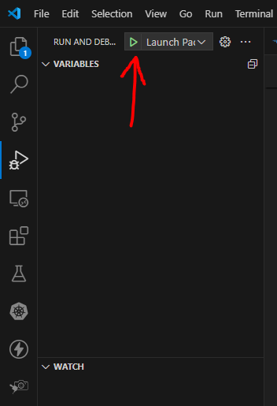
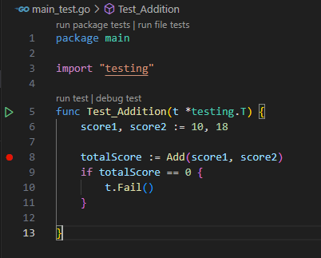

# Debugging in Go

## Go code

Create a new main.go file and add the following:

```go
package main

import "fmt"

func main() {

	firstNumber := 10

	secondNumber := 20

	total := firstNumber + secondNumber

	fmt.Println(total)
}
```

Don't forget to run `go mod init`. I used `go mod init go-debugging`.

## Setting Up
Setting up the debugging configuration in Go is pretty simple and straightforward. From your VS Code’s sidebar menu, click on the Run and Debug button:


then click on create a launch.json file:


You’ll see a dropdown menu, select Go for environment language. Finally, select **Launch Package** for debug configuration. This configuration will create the `launch.json` file, which will contain the following code:


```json
{
    // Use IntelliSense to learn about possible attributes.
    // Hover to view descriptions of existing attributes.
    // For more information, visit: https://go.microsoft.com/fwlink/?linkid=830387
    "version": "0.2.0",
    "configurations": [
        {
            "name": "Launch Package",
            "type": "go",
            "request": "launch",
            "mode": "auto",
            "program": "${fileDirname}"
        }
    ]
}
```

Change the value for program in the JSON settings above to the application file name, main.go in our case:

`"program": "main.go"`

After you save the `launch.json` configuration, the `DEBUG CONSOLE `at the bottom of the editor window will display your project’s output. The debug toolbar will appear at the top of the screen, allowing you to step through the code, pause the script, or end the session.

To debug the application, click on the play icon near `RUN AND DEBUG`: 



which will display the program output in the `DEBUG CONSOLE` window.

## Install Delve

Run the following from the terminal:

`go install github.com/go-delve/delve/cmd/dlv@latest`

## Debugging using breakpoints

A breakpoint allows you to inspect a line of code by pausing its execution. Breakpoints can be set practically anywhere in VS Code, including variable declarations, expressions, comments, and blank lines, with the exception of function declaration statements.

Let's add breakpoints to lines 7, 9 , 11 and 13. Simply click to the left of the line number, and you’ll see a red dot appear:


When you debug the program above, execution will pause at each breakpoint. First, the program will automatically pause on line 7:


A debug toolbar appears at the top of the screen:


By clicking on the Continue button (or using F5), the program will resume execution until the next breakpoint on line 9.

You will also see on the left in the Locals window, the value in the `fistNumber` variable:


Clicking Continue (or F5) will continue execution to the next breakpoint on line 11, and then on line 13.

## Debug Toolbar

### Continue F5
You can use the continue F8 button to resume the program’s execution when it pauses at a breakpoint. When debugging your Go program in VS Code, you can add as many breakpoints as you want.

### Step over F10
The step over command F10 runs the line of code that is currently highlighted before moving on to the next line. You can use the step over command to advance down a function, fully comprehending how it is executed.

If you use the step over command on a line that calls a function, it will execute the whole function, pausing at the first line underneath the function. 

### Step into F11
Like the step over command, we can use the step into command to debug a program line-by-line. However, if the step into command encounters a function, the debugger will enter the function that was called, continuing to debug line-by-line from there.

### Step out Shift+F11
The step out command continues the current function’s execution, pausing at the last line. For example, if you mistakenly type a function that has nothing to do with the problem you’re trying to address, you can use the step out command to quickly exit the function and return to the relevant part of your codebase.

### Stop Shift+F5
Once you’ve finished debugging your program, use the stop command to exit the debugging session. When you connect to an external Node.js process, a disconnect icon will appear.

## VARIABLES panel
Now that we’ve reviewed the functionalities available in the debug toolbar, let’s review the additional tabs in our VS Code editor. In the VARIABLES panel, you can see the values of variables and expressions that were evaluated at the breakpoint.

Additionally, by right-clicking on any of the values in the context menu, you can set Value, Copy Value, or Add to Watch for the variable.

## WATCH panel
When the code is paused, you can bring the values that you want to monitor into view in the WATCH panel. Rather than having to go through the VARIABLES panel each time you want to check a value, you can add a deeply nested property to the WATCH panel for easy access.

This is especially useful for finding the values of numerous variables at once because they are all immediately recalculated during execution.

## Debugging Unit Tests

We don't just have to debug our main program - we can also debug our tests.

Add the following function to your `main.go` file:

```go
func Add(firstNumber int, secondNumber int) int {
	
	total := firstNumber + secondNumber

	return total
	
}
```

Now create a new test file, `main_test.go`:

```go
package main

import "testing"

func Test_Addition(t *testing.T) {
    score1, score2 := 10, 18

    totalScore := Add(score1, score2)
    if totalScore == 0 {
        t.Fail()
    }

}
```

To run the unit test, enter the command below:

`go test`

Now let’s debug our test file by adding a breakpoint to the program as shown below on line 8:



To debug the test, rather than run it, on the green arrow next to the test name, right click it and select "Debug" from the dropdown menu.

It will stop at the breakpoint. Using the Step Over (F10) button on the debug bar steps to the next line, and shows the `totalScore` in the Variables window on the left:


## Wrapping Up

There's a lot more to learn, but being able to set breakpoints allows us to inspect out code in real time, rather than printing out to the console!

There are more advanced breakpoints, known as *Conditional Breakpoints*, and *Logpoints*. Instead of pausing the code execution and breaking into the debugger, the *logpoint* is a type of breakpoint that logs a message or value to the console.

But that's beyond the scope of this guide, you'll have to find out that for yourself!